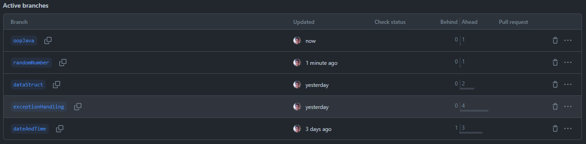

# Java roadmap.sh

Esse repositório serve para que eu possa guardar meu progresso que eu faço seguindo a trilha de java do site
[roadmap.sh](https://roadmap.sh/java)

_tentarei_ manter nele somente projetos da trilha

## Atenção as atividades são salvas em branchs, há um branch para cada tema

## Objetivo

O objetivo desse repositório não é me tornar um especialista em Java da noite pro dia, mas sim conseguir me sentir confortável em trabalhar com qualquer projeto de Java, que eu encontre na minha carreira.

## Objetivos Futuros

Espero que no futuro, eu possa criar um outro repositório para me tornar um especialista, capaz de contribuir para projetos FOSS como particulares e poder contribuir para a sociedade, uma fração do que ela contribuiu para mim.
